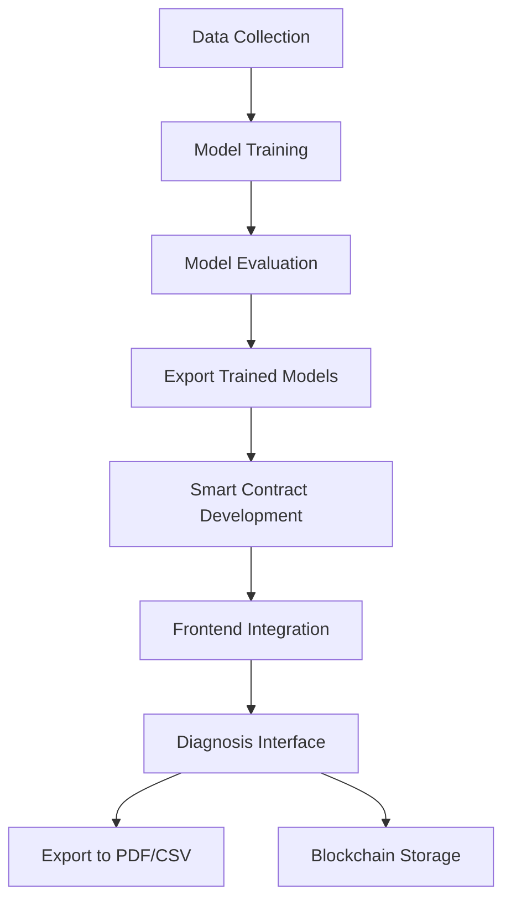

---

# 🧠 AI-Powered Medical Diagnosis System with Blockchain Integration

An end-to-end healthcare diagnosis system that uses **machine learning** for predicting medical conditions and **blockchain** for secure data storage and transparency. 
This project combines the power of AI for intelligent medical insights and Ethereum smart contracts for verifiable, tamper-proof diagnosis records.

---

## 📌 Table of Contents

- [Overview](#overview)
- [Project Workflow](#project-workflow)
- [Tech Stack](#tech-stack)
- [1. Model Building](#1-model-building)
- [2. Smart Contract Creation](#2-smart-contract-creation)
- [3. Frontend Application](#3-frontend-application)
- [4. Data Export](#4-data-export)
- [Running the Project](#running-the-project)
- [Screenshots](#screenshots)
- [Future Enhancements](#future-enhancements)

---

## ✅ Overview

This system provides doctors and medical staff with a powerful diagnostic tool. Users input patient symptoms, and the system returns disease predictions using two different models:

- **Logistic Regression (LR)** – baseline predictions.
- **Neural Network (NN)** – advanced predictions with confidence scores.

Each diagnosis is recorded and can be exported to PDF or CSV. The results are also stored securely on a blockchain via a custom Ethereum smart contract, ensuring transparency and immutability.

---

## 🔁 Project Workflow



---

## 🧰 Tech Stack

### ⚙ Backend / AI:
- Python (Scikit-learn, TensorFlow/Keras)
- Logistic Regression & Neural Network
- Pandas, NumPy

### 🧾 Blockchain:
- Solidity Smart Contract
- Truffle for deployment
- Ethers.js or Web3.js for integration

### 🎨 Frontend:
- React.js
- jsPDF & jsPDF-AutoTable
- PapaParse for CSV
- FileSaver.js

---

## 🔬 1. Model Building

### Data Processing
Collected medical datasets related to common symptoms like:
- **anxiety_and_nervousness**, **depression**, **dizziness**, **shortness_of_breath**, **insomnia**, **palpitations**, etc.

### Training
- **Logistic Regression Model**: Lightweight and interpretable.
- **Neural Network Model**: 2-layer dense network with ReLU activation and softmax output.

### Evaluation
- Evaluated using accuracy, precision, recall, and F1-score.
- Saved models as `.pkl` for deployment.

---

## 🔐 2. Smart Contract Creation

### Features:
- Stores: `patientId`, `symptoms`, `LR prediction`, `NN prediction`, `confidence score`, and `recordedBy`.
- Emits an event when a new diagnosis is stored.
- Ensures immutability and auditability of diagnosis records.

solidity
event DiagnosisRecorded(uint id, string patientId, string diagnosisNN);
function recordDiagnosis(...) public;
function getDiagnosis(uint id) public view returns (...);

Deployed to local blockchain (Ganache).

---

## 💻 3. Frontend Application

Built with React:

### Components:
- `DiagnosisForm`: Inputs patient symptoms and doctor info.
- `DiagnosisList`: Displays stored diagnoses.
- `ExportButtons`: One-click PDF and CSV exports.

### Highlights:
- Converts confidence scores into readable percentages.
- Ensures clean, professional PDF reports with tabular data.
- Smooth integration with the blockchain using Web3/Ethers.

---

## 📤 4. Data Export

- 📄 PDF: Uses `jsPDF` and `jspdf-autotable`.
- 📁 CSV: Uses `PapaParse` and `FileSaver`.

### Exported Columns:
- Patient ID
- Symptoms
- LR Prediction
- NN Prediction
- Confidence Score
- Recorded By (Doctor Name)

---

## ▶ Running the Project

### Backend & Model Training
cd DiseasePrediction
DiseaseAnalysis.ipynb

### Smart Contract Deployment
cd Hospital_Management_System
truffle compile
migration: truffle migrate 

### Flask Backend
The backend is in a python environment because of dependancies and python version issues:
.venv\Scripts\activate
cd DiseasePrediction
python app.py

### React Frontend
cd diagnosis_dapp/src
npm install
npm start
```

Ensure MetaMask or Web3 wallet is connected for blockchain features.

---

## 🖼 Screenshots

### Diagnosis Entry


### Stored Diagnoses


### PDF Export


---

### 🚀 Future Enhancements

- Add user authentication (doctors only).
- Store uploaded medical images with predictions.
- Deploy smart contract on mainnet.
- Add data visualization for diagnosis statistics.
- Support voice input for symptoms.

---

########################################################################################
🩺 Decentralized Medical Diagnosis System.

This project is a blockchain-powered medical diagnosis platform that enables authorized doctors to diagnose patients and securely store the results on the Ethereum blockchain.
The system uses machine learning models to predict potential diseases based on patient symptoms and records the results immutably for auditability and patient safety.
This project is a basic Proof Of Concept and can be improved further.


🚀 Features:

🔐 Blockchain Security: All diagnoses are stored on Ethereum, ensuring transparency and tamper resistance.

🧠 AI Integration: Uses Logistic Regression and a Neural Network to predict diseases.

🧾 Export Options: Export diagnosis reports as PDF or CSV.

👨‍⚕️ Access Control: Only admin can record diagnoses.


🛠️ Technologies Used.

1. React.js Frontend for submitting forms and displaying data.

2. Flask (Python) Backend ML API for disease prediction.

3. Solidity Smart contract for recording and controlling access.

4. Web3.js Interact with the smart contract from React frontend.

5. Ganache Local Ethereum blockchain for development and testing.   

6. MetaMask Ethereum wallet to connect user accounts jsPDF / PapaParse. 

7. Export diagnosis data as PDF or CSV.   


⚙️ How to Run the Project Locally with Ganache


✔️ Install Prerequisites

1. Make sure you have:

2. Node.js & npm

3. Python 3.8+

4. Ganache

5. MetaMask browser extension


✔️ Clone the Repository

github: 

cd Health_Management_System


✔️ Start Ganache

1. Open Ganache GUI


✔️ Compile & Deploy Smart Contract

If using Truffle:

1. Make sure you are at the smart contracts location.

2. truffle compile

3. truffle migrate --reset / truffle migrate --reset --network development

4. Copy the deployed contract address into your frontend config.js:

👉 export const CONTRACT_ADDRESS = "0xYourDeployedContractAddress";


✔️ Run Flask Backend

1. Ensure you are at the flask app folder.

2. pip install -r requirements.txt

3. python app.py

⚡ Flask will run at http://127.0.0.1:5000


✔️ Run React Frontend

1. Make sure you are at the React Frontend.

2. npm install

3. npm start

⚡ React will run at http://localhost:3000


✔️ Connect MetaMask

1. Import one of Ganache's private keys into MetaMask.

2. Connect to the Ganache local network. (HTTP://127.0.0.1:7545)

3. Refresh your browser.


✅ Done!

You can now:

1. Submit symptoms via the form

2. Predict diseases via AI models

3. Record data on the blockchain

4. Export results as PDF or CSV
